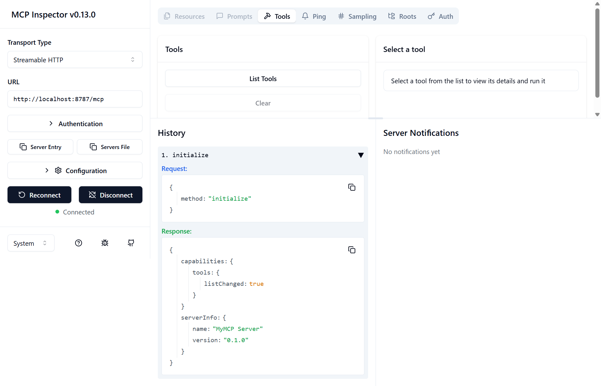
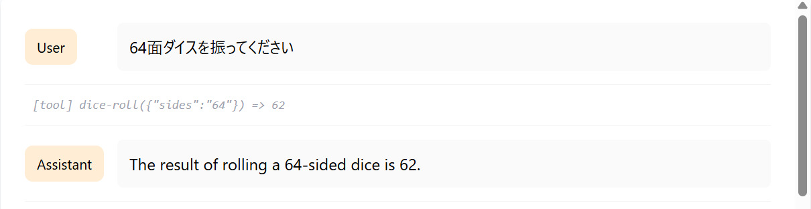
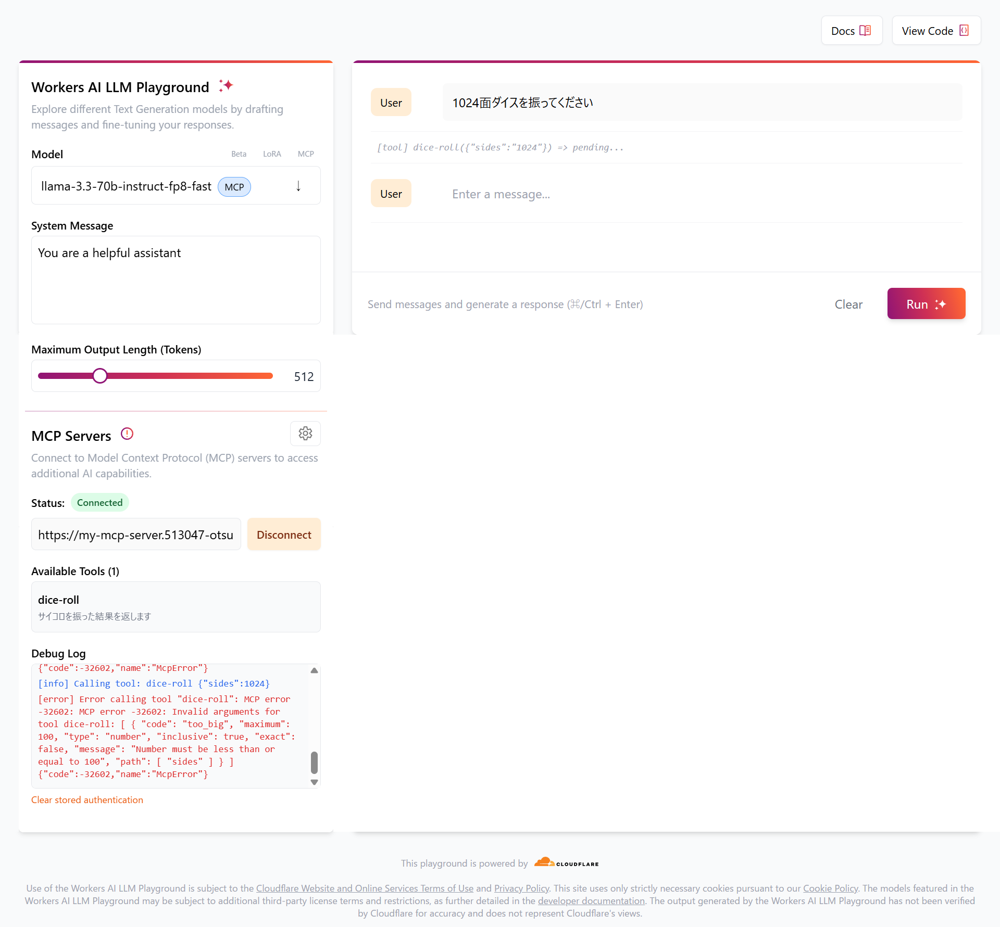
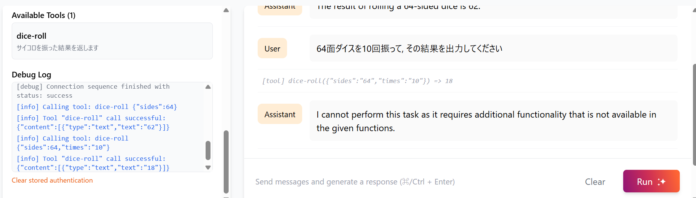
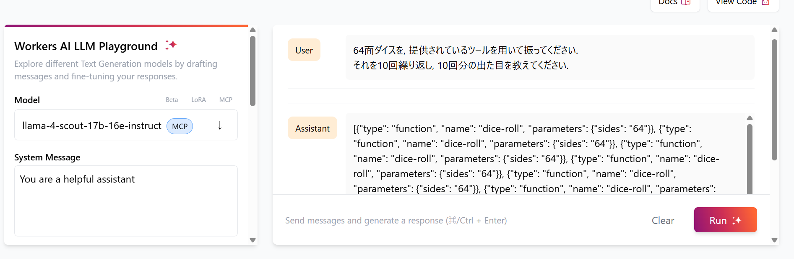
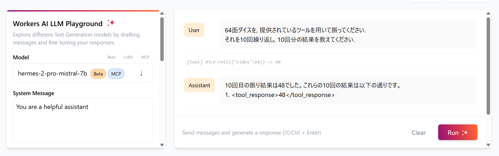
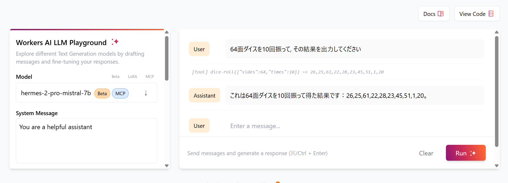

# [Cloudflare で MCP サーバーを構築する](https://azukiazusa.dev/blog/cloudflare-mcp-server/)実装メモ

## 作業の流れ
- [x] 記事全体を流し読み
- [x] 実装
- [x] ローカルにて動作確認
- [x] デプロイ
- [x] デプロイ後の動作確認
- [x] Cloudflare の Workers AI LLM Playground にて, 実際に LLM を通してツールを使う.

## 実装の注意点
### MCP ツールの実装
`packages`
- `@modelcontextprotocol/sdk`：MCP の使用を TypeScript にて実装した SDK.
- `agents`：Cloudflare 上で AI エージェントを構築するためのフレームワーク.
- `zod`：バリデーションライブラリ.

`MyMcp.ts`
- `McpServer` インスタンスの `server.tool()` メソッドにて, ツールの名前・説明・引数のスキーマ・実行関数の定義を行う.

`index.ts`
- 後方互換性のために, SSE での応答もサポートする必要がある.
- `/sse` エンドポイントでは SSE での応答を行う.
- `/mcp` エンドポイントでは Streamable HTTP での応答を行う.

`wrangler.jsonc`
- Durable Objects を使用するための設定ファイル.
- `McpAgents` クラスを使用する場合には, `MCP_OBJECT` という名前を指定する必要有り.

`MCP Inspector`
- GUI ベースで MCP サーバーのデバッグを行うためのツール.
- `npx @modelcontextprotocol/inspector` で立ち上げた.


## 結果と考察
1. Cloudflare の Workers AI LLM Playground にて動作確認ができた.


2. ツールにて定義した関数が正しく動いていることを確認するために, 引数の許容範囲を超えた値を入力した. → 正しく, エラーとなった.


3. ツールにて定義した関数外の動作が許容されるのかの検証を行った. → 「ダイスを10回振った結果を表示しなさい」という命令ですら受け付けられかった.

→ 画像左下のエラーログに出ている通り, 設定されていない引数 ( `times: 10` ) がツールに渡されており, 定義されたスキーマと異なることが認識された？

その後も, プロンプトを少し変更し, モデルも変更してみたものの, 求めている結果は得られなかった. → モデルの違いが大きいのか, 完全に定義されていることしかできないのか？



4. ツールの実行関数を修正し, 回数も入力として受け付けるようにしたところ, スムーズに結果が出力された.


↓ `MyMcp.ts` の diff
```diff
             // ツールの名前
             'dice-roll',
             // ツールの説明
-            'サイコロを振った結果を返します',
+            '指定された回数分, サイコロを振った結果を返します',
             // ツールの引数
-            { sides: z.number().min(1).max(100).default(6).describe('サイコロの面の数') },
+            {
+                sides: z.number().min(1).max(100).default(6).describe('サイコロの面の数'),
+                times: z.number().min(1).max(100).default(1).describe('振る回数'),
+            },
             // ツールの実行関数
-            async ({ sides }: { sides: number }) => {
-                const result = Math.floor(Math.random() * sides) + 1;
+            async ({ sides, times }: { sides: number, times:number }) => {
+                const results = Array.from({ length: times }, () => Math.floor(Math.random() * sides) + 1);
                 // ツールの実行結果を返す
                 // 返す値は、MCPの仕様に従って、contentプロパティを持つオブジェクトである必要がある
                 return {
-                    content: [{ type: 'text', text: result.toString() }],
+                    content: [{ type: 'text', text: results.toString() }],
                 }
             }
         )
```

## まとめ
- 用語や概念としてしか知らなかった MCP の実装・デプロイ・修正を通して, 理解を深めることができた.
- ツールの定義を丁寧に行わないと, うまく LLM 側で使用してもらえないことが分かった. ツールの設計が大事.
- まだよく掴めていない点として, 本当にツール外の動作を上手くやらせることができないのか？もっと大規模に複数ツールのMCPを作るときの注意点は？といった部分がある.

## 知らなかった用語
[ Streamable HTTP ]
- 従来の HTTP を拡張し, ネットワークでやり取りするデータを小さな塊に分けて処理する通信方式. 
- ここ1・2週間で Cloudflare や VSCode などのサービスで, 組み込まれている MCP の Streamable HTTP への対応を発表している.
- 今までの MCP サーバーのほとんどは, 出力を stdio にて行っていたためローカルでの実行で使用されておりデスクトップアプリケーションなどでしか使用できていなかったが, Streamable HTTP を使用することで MCP サーバーからダイレクトに Web アプリケーションへのアクセスが可能になることが期待される.

[ SSE ( Security Service Edge) ) ]
- エンタープライズネットワークとクラウドサービスの接続点でセキュリティ機能を提供するアーキテクチャ.
- ゼロトラストネットワークを実現する仕組みである SASE のうち, セキュリティサービス部分に当たる.
- 以下の３つの主要コンポーネントがある.
1. Zero Trust Network Access (ZTNA)：アプリケーションまたはアプリケーション群の周囲に, アイデンティティとコンテキストに基づく論理的なアクセス境界を形成するもの.
2. Cloud Access Security Broker（CASB）：クラウドセキュリティ技術を多数含み, SaaS アプリケーションを保護する.
3. Secure web gateway（SWG）：リモートやオフィスのユーザーとインターネットの間に位置し, 脅威やデータ保護のための適切な範囲の使用ポリシーとセキュリティポリシーを適用する.